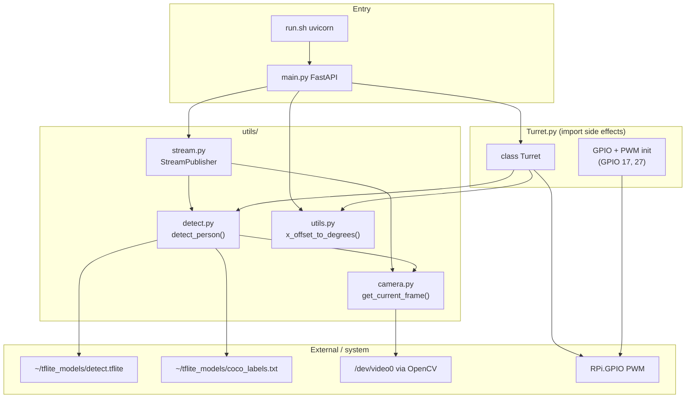

# raspi-turret — architecture & bring-up

Companion to the root [README.md](../README.md). Use this to remember how the code fits together after time away from the project.

**Pi deploy path:** `/home/aclarke500/Desktop/tflite-prac`

---

## What this does (today)

1. Capture video from a **USB webcam** (1280×720) in a background thread.
2. While the **X servo** patrols (from current angle, no reset to 0° on re-acquire), run person detection on each stop.
3. When a person is seen, **follow_target** keeps tracking until lost; creeps pan and tilt until crosshair is within **BOX_CENTER_TOLERANCE** (5% of box width/height) of the person box centroid.
4. After **TRACK_LOST_FRAMES** consecutive misses, hold last pan/tilt briefly then resume patrol.

**Dual-axis tracking:** Pan (GPIO 17) and tilt (GPIO 27) via `Y_SERVO_ENABLED = True`. Tilt is clamped **75°–125°** (`Y_HOME_ANGLE = 100°` level) through `Turret.rotate_y_servo()`. **No fire/trigger GPIO exists in code yet.**

---

## Rewiring checklist (nothing connected right now)

When you reconnect hardware, use **BCM** pin numbers (what the code uses).

| Function | BCM GPIO | Physical pin (40-pin header) | Wire to |
|----------|----------|-------------------------------|---------|
| X servo signal (pan) | **17** | **11** | Servo signal (orange/yellow) |
| Y servo signal (tilt) | **27** | **13** | Servo signal |
| Servo power | — | **2 or 4** (5V) | Prefer **external 5V** for two servos; share GND with Pi |
| Servo ground | — | **6, 9, 14, 20, 25, 30, 34, or 39** (GND) | Servo GND + supply GND |
| USB webcam | — | Any USB port | Should appear as `/dev/video0` |

**Servo control:** [`utils/servo_driver.py`](../utils/servo_driver.py) — RPi.GPIO 50 Hz PWM by default, optional **pigpio** (`USE_PIGPIO = True`, run `sudo pigpiod`). After each move: settle, then **release pulse** (`ChangeDutyCycle(0)`) to reduce buzzing. Tune in [`utils/servo_config.py`](../utils/servo_config.py).

**Servo power (reduces jitter):** Use **external 5V** for servos; common GND with Pi. A **100–470 µF** cap across servo power helps. Pi 5V pin alone often causes twitching under load.

**Before powering on:** Do not run `led_test.py` while the X servo is on GPIO 17 — that script uses the same pin as a digital output.

---

## File map

| File | Role |
|------|------|
| `main.py` | **Production entry point.** FastAPI app: auto-starts patrol thread + MJPEG stream. |
| `run.sh` | Activate venv and run `uvicorn main:app --host 0.0.0.0 --port 8000`. |
| `utils/stream.py` | `StreamPublisher`: 5 FPS annotated JPEG buffer for `/video`. |
| `Turret.py` | `Turret` class: `patrol()`, `follow_target()`, `hold_last_angle()`, uses `servo_driver`. |
| `utils/servo_config.py` | Jitter tuning: release pulse, min move, max step, deadband, `USE_PIGPIO`. |
| `utils/servo_driver.py` | `GpioPwmDriver` / `PigpioDriver` — rate-limited `set_angle()`. |
| `utils/camera.py` | OpenCV `VideoCapture(0)`, background thread, `get_current_frame()`. |
| `utils/detect.py` | TFLite SSD: `detect_person()`, `annotate_frame()`, `get_target_direction()` → normalized (x, y). |
| `utils/utils.py` | `x_offset_to_degrees` / `y_offset_to_degrees` from assumed 55° diagonal FOV, 16:9. |
| `coco_labels.txt` | COCO class names — copy to `~/tflite_models/` per root README. |
| `requirements.txt` | numpy, opencv-python-headless, pillow, tflite-runtime, fastapi, uvicorn. |
| `hardware_tests/servo_test.py` | Bench test: pan sweep 0° / 90° / 180° (uses servo_driver). |
| `hardware_tests/servo_hold_test.py` | Hold 90° for 10s — check for buzzing at rest. |
| `hardware_tests/camera_test.py` | Bench test: 10 OpenCV frames → `test_photos/frame_01.jpg` … (1280×720, 0.1s apart). |
| `hardware_tests/picam_test.py` | Pi-only: picamera2 detect CSI camera → one frame → `picam_photos/picam_test.jpg`. |
| `hardware_tests/ai_test.py` | Bench test: `get_target_direction()` loop up to 5 min (Ctrl+C to stop) — normalized (x, y) from frame center. |
| `calibrate_y_motor.py` | Bench test: GPIO 27 sweep 0–270°. |
| `led_test.py` | Blink GPIO 17 — conflicts with X servo on same pin. |
| `s.py` | Alternative servo test using **pigpio** on GPIO 17. |
| `compute_fov.py` | Standalone print of horizontal/vertical FOV from diagonal FOV. |
| `photo.sh` | Legacy: grab one frame via ffmpeg → `test.jpg`. |
| `main.sh` | Legacy: `photo.sh` + `python detect.py`. |
| `detect.py` (repo root) | **Fully commented out** — old snapshot + detect path. |
| `utils/servo.py` | Standalone GPIO 17 helper; **not used** by `main.py`. |

---

## Code dependency diagram



**Import note:** `from Turret import Turret` runs **all top-level code** in `Turret.py` (GPIO setup, signal handlers) before `main.py` calls `T.setup()`.

---

## Happy path (runtime)

```mermaid
sequenceDiagram
    participant User
    participant main as main.py
    participant T as Turret
    participant Cam as utils/camera
    participant Det as utils/detect

    User->>main: python main.py
    Note over Cam: Background capture thread starts when detect/camera loads
    main->>T: Turret(); setup() → pan to 0,0

    loop Forever
        main->>T: patrol()
        loop Sweep X 0..270..0
            T->>T: set_x_angle(angle)
            T->>Det: get_target_direction()
            Det->>Cam: get_current_frame()
            Det->>Det: TFLite infer "person"
            alt person found
                Det-->>T: x_norm, y_norm
                T-->>main: offsets
            end
        end

        alt target seen
            main->>T: follow_target()
            loop until lost
                T->>T: creep or hold pan
                T->>Det: get_target_detection()
            end
            main->>T: hold_last_angle()
        end
    end

    User->>main: Ctrl+C
    main->>T: cleanup()
```

### Prerequisites (on the Pi)

1. Raspberry Pi OS with `RPi.GPIO` and `tflite_runtime` available.
2. Python venv + dependencies (see root README and `requirements.txt`).
3. Model at `~/tflite_models/detect.tflite` and labels at `~/tflite_models/coco_labels.txt`.
4. USB webcam on `/dev/video0` (OpenCV device index `0`).
5. Servos rewired per table above.

### Run

```bash
cd /home/aclarke500/Desktop/tflite-prac
bash run.sh
```

Browser (same LAN): `http://<pi-ip>:8000/` — live MJPEG with person boxes and center crosshair.

| Route | Purpose |
|-------|---------|
| `GET /` | HTML page with embedded stream |
| `GET /video` | MJPEG stream (5 FPS, 640×480 annotated) |
| `GET /api/status` | JSON: turret_running, x_angle, last_detection, stream_fps |

Patrol auto-starts on server startup. Stream and patrol may both run inference (acceptable for v1 debugging on Pi 4).

**Security:** No auth in v1 — LAN only. Do not expose port 8000 to the public internet.

### Bench hardware before full stack

```bash
python hardware_tests/servo_test.py       # pan sweep with release-pulse
python hardware_tests/servo_hold_test.py  # hold 90°, listen for buzz
python hardware_tests/camera_test.py   # USB webcam burst to test_photos/
python hardware_tests/picam_test.py    # Pi CSI camera → picam_photos/picam_test.jpg
python hardware_tests/ai_test.py       # person detect; prints center-relative x, y
python calibrate_y_motor.py            # Y axis only (GPIO 27)
```

---

## Detection pipeline

1. `utils/camera.py` continuously reads and resizes to **1280×720**.
2. `get_target_direction()` resizes the frame to **300×300** and runs TFLite.
3. Keeps detections with `score > 0.5` and COCO label `"person"`.
4. Returns offset normalized to roughly ±1 relative to frame center:
   - `x_normalized = (person_cx - center_x) / (width / 2)`
   - same pattern for Y
5. `x_offset_to_degrees(x) = -x * hfov / 2` where hfov ≈ 48.5° (from 55° diagonal, 16:9 in `utils/utils.py`).

---

## Legacy path (superseded)

Older flow used still frames instead of live video:

1. `photo.sh` — ffmpeg grabs one image → `test.jpg`
2. `main.sh` — runs `photo.sh` then `python detect.py`
3. Root `detect.py` — **entirely commented out**; was the old detect + servo experiment

Current production path uses `utils/camera.py` + `utils/detect.py` only.

---

## Tracking / follow loop (current)

1. `patrol(reset_home=False)` sweeps pan from **current angle** (only `setup()` homes to 0°); on person found returns offsets.
2. `follow_target()` runs until `TRACK_LOST_FRAMES` consecutive `NO_PERSON` frames — does **not** exit on `HOLD`; creeps pan/tilt when crosshair is outside the 5% box-center dead zone.
3. `hold_last_angle()` pauses `TRACK_LOST_HOLD_SEC` at last pan and tilt, then patrol resumes.
4. `detect_person()` picks **highest-score** person, not first tensor slot. Out-of-range class ids (e.g. 81) are ignored with a warning.

## Known quirks / tech debt

1. **Software PWM** — RPi.GPIO can still jitter vs pigpio; set `USE_PIGPIO = True` after `sudo pigpiod` if needed.
2. **Signal handlers** in `Turret.py` on import.
3. **Y axis** — GPIO 27, safe range 75–125° (100° home); all tilt moves use `rotate_y_servo()` clamping.
4. **`requirements.txt` omits `RPi.GPIO` / `pigpio`** — install on the Pi when setting up the venv.
5. **Shooting** — not implemented in GPIO or Python yet.
6. **Dual inference** — stream + patrol both run TFLite (CPU load).

---

## Raspberry Pi 40-pin header (quick reference)

```
     3V3  (1) (2)  5V
   GPIO2  (3) (4)  5V
   GPIO3  (5) (6)  GND
   GPIO4  (7) (8)  GPIO14
     GND  (9) (10) GPIO15
  GPIO17  (11) (12) GPIO18   ← X servo signal (pin 11)
  GPIO27  (13) (14) GND      ← Y servo signal (pin 13)
  ...
```

BCM **17** = physical **11**, BCM **27** = physical **13**.
